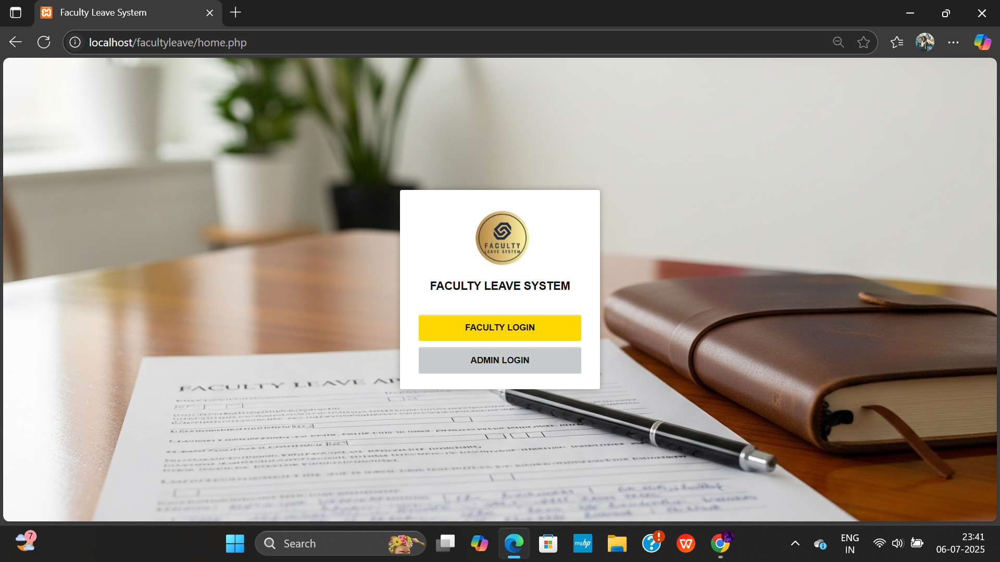
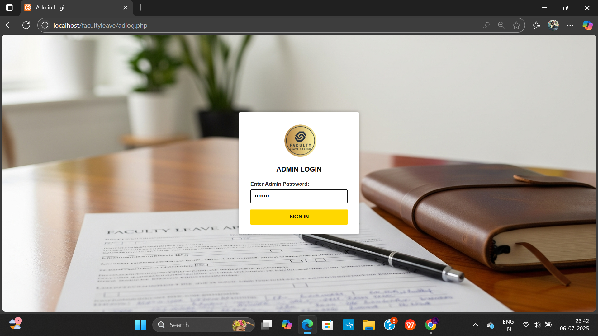
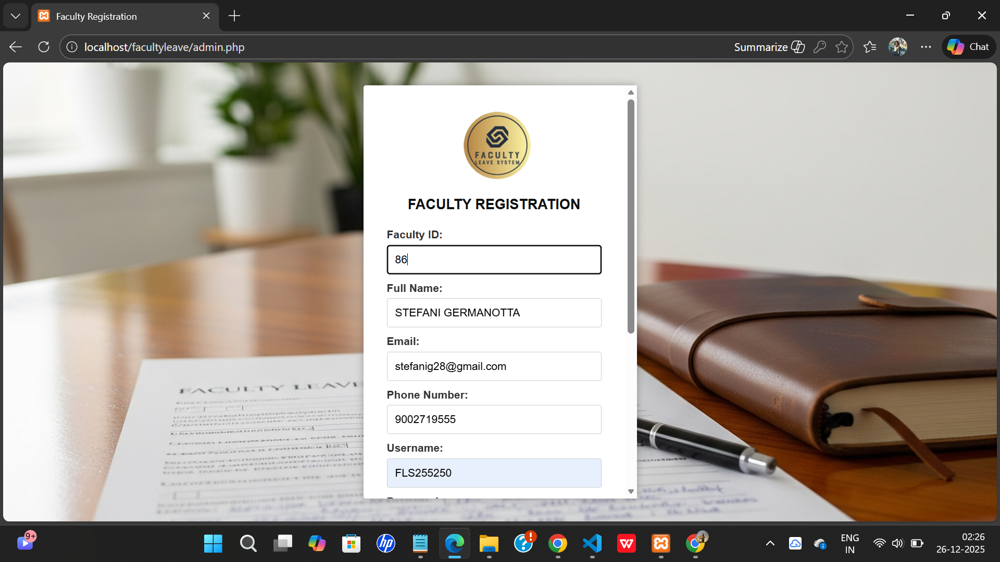
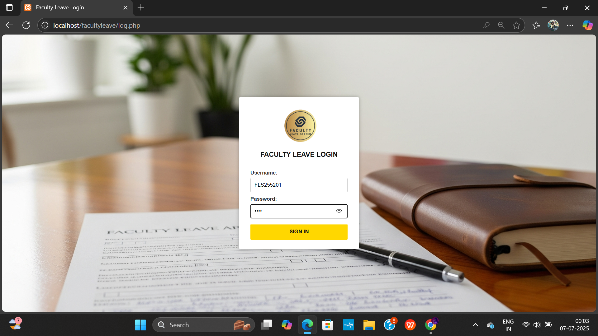
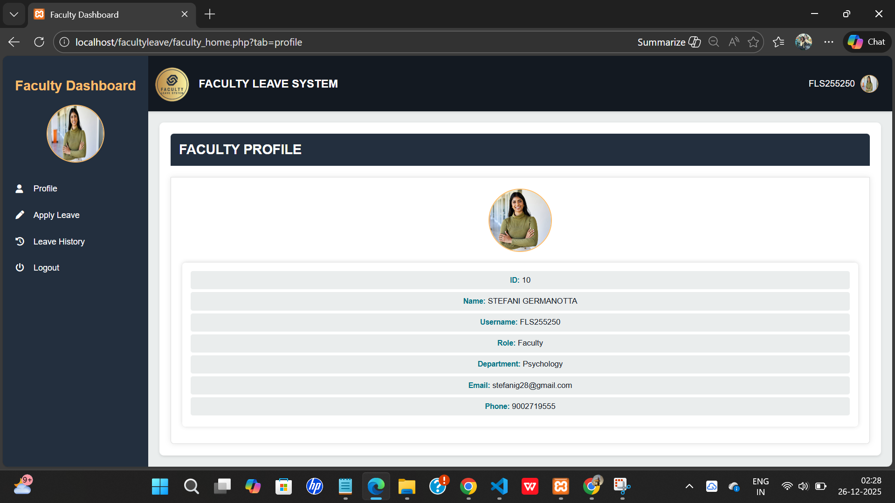
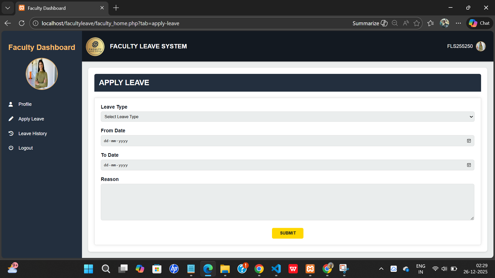
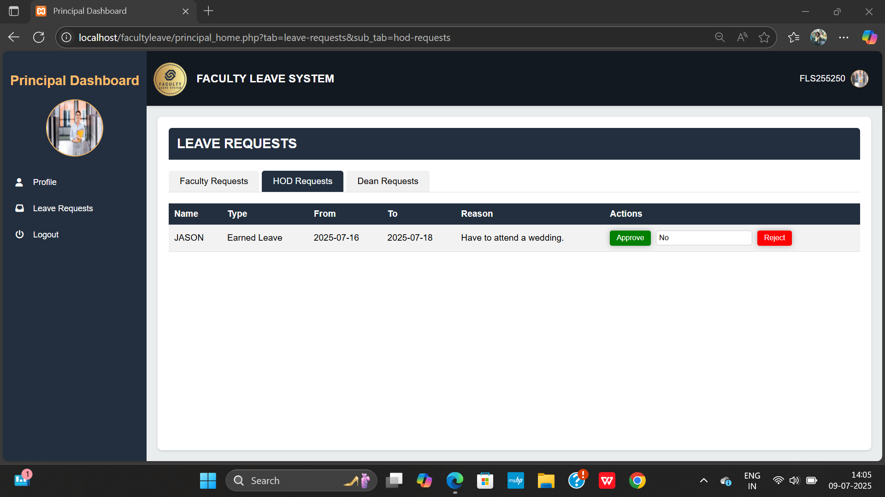
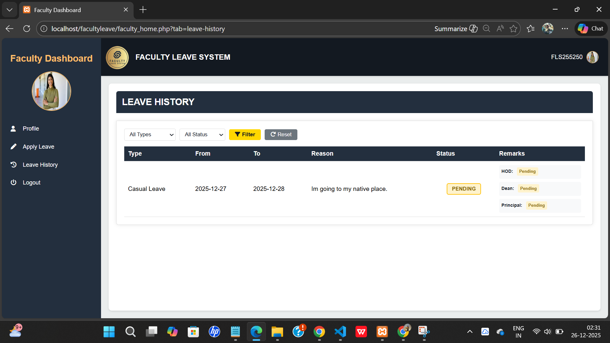
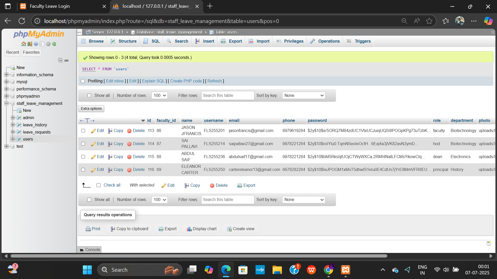

Hello there, it's Dhriti here thank you for stopping by my project here's what it is about:


📝 **Faculty Leave System**

This is a web-based application to make it easy and automate the faculty leave request and approval process.


📌 **Project Summary**

The Faculty Leave System allows faculty members to submit leave requests and enables department heads, deans, and principals to review, approve, or reject them. It provides role-based access to ensure secure and smooth handling of the entire workflow. Users will have to register their details manually in this code, but you can upload a CSV file in the database with the respective information. The functionality remains the same.


📸 Preview

🏠 1. Home Page  


🔐 2. Admin Login  


🧾 3. Faculty Registration  


🔓 4. Faculty Login Page  


👨‍🏫 5. Faculty Dashboard  


📝 6. Leave Application Form  


🧑‍⚖️ 7. Leave Requests — Principal Dashboard 


🕓 8. Leave History  


🗄️ 9. Database Storage (phpMyAdmin)  



⚙️ **Features**

- 👨‍🏫 Faculty can apply for leave with just a few clicks.
- 🧑‍💼 Role-based dashboards for:
  - Faculty
  - HOD
  - Dean
  - Principal
  - Admin
- 📜 Leave history tracking
- ✅ Approval system with status updates


🛠️ **Technologies Used**

- Frontend: HTML, CSS, JavaScript, Ajax, jQuery
- Backend: PHP
- Database: MySQL
- Server: XAMPP (Apache + MySQL)


🚀 **How to Run the Project Locally**

Download or Clone this repository:

```bash
git clone https://github.com/dhritijm08/faculty-leave-system.git
